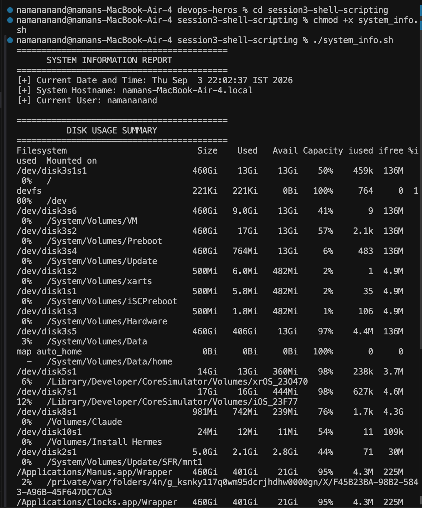
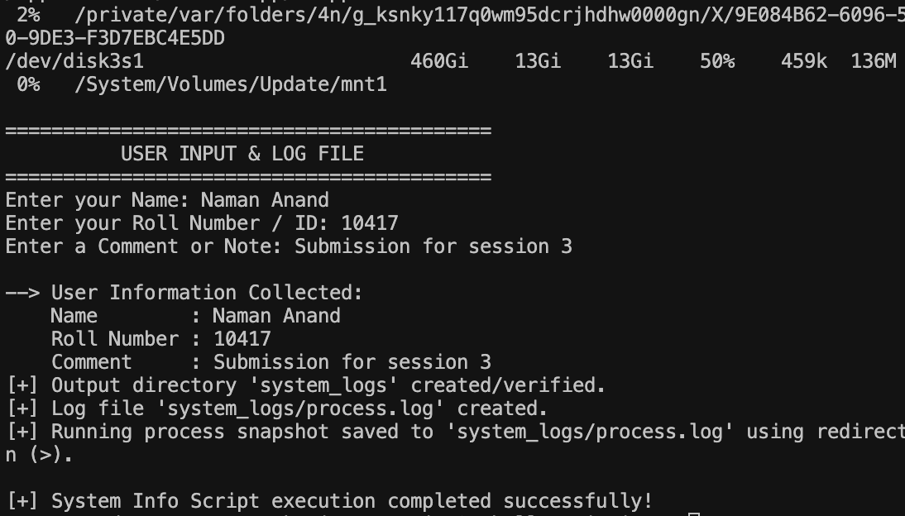
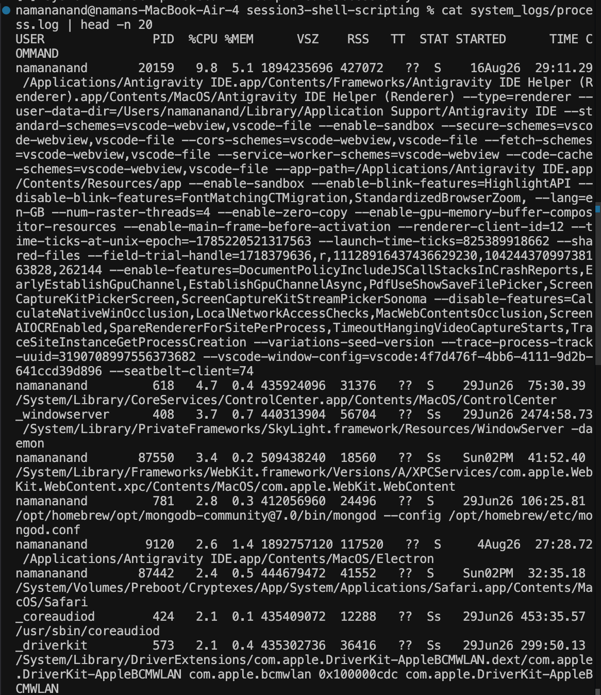

# Session 3: Shell Scripting

## Overview
This session covers Linux Shell Scripting fundamentals, including variables, control flow, interactive user input, file/directory manipulation, and output redirection.

---

## Homework Task: System Information Script

### Task Description
Create an interactive bash script (`system_info.sh`) that fulfills the following requirements:
1. Prints the current date.
2. Prints the system hostname.
3. Prints the logged-in username.
4. Displays the current disk usage.
5. Takes user input interactively (`read -p`) for Name, Roll Number, and Comments.
6. Uses variables to store and display data.
7. Creates a new directory (`mkdir`).
8. Creates a log file (`touch`).
9. Captures all running processes (`ps`) and saves the snapshot into the log file using output redirection (`>`).

---

## Commands Used
- `date` : Displays current system date and time.
- `hostname` : Displays host system network name.
- `whoami` : Displays active user username.
- `df -h` : Reports file system disk space usage in human-readable format.
- `read -p` : Reads user input from terminal prompt into variables.
- `mkdir -p` : Creates target directory if it doesn't already exist.
- `touch` : Creates target log file.
- `ps aux` : Lists detailed snapshot of active running processes.
- `>` : Redirects command output to file.

---

## Script Code (`system_info.sh`)

```bash
#!/bin/bash
# ==============================================================================
# Script Name: system_info.sh
# Description: System Information Shell Script for DevOps Session 3 Homework
# ==============================================================================

echo "=========================================="
echo "      SYSTEM INFORMATION REPORT          "
echo "=========================================="

# 1. Store and display Current Date
CURRENT_DATE=$(date)
echo "[+] Current Date and Time: $CURRENT_DATE"

# 2. Store and display Hostname
SYS_HOSTNAME=$(hostname)
echo "[+] System Hostname: $SYS_HOSTNAME"

# 3. Store and display Current Username
SYS_USER=$(whoami)
echo "[+] Current User: $SYS_USER"

echo ""
echo "=========================================="
echo "          DISK USAGE SUMMARY              "
echo "=========================================="
# 4. Display Disk Usage
df -h

echo ""
echo "=========================================="
echo "          USER INPUT & LOG FILE           "
echo "=========================================="

# 5. Take User Input using read -p
read -p "Enter your Name: " USER_NAME
read -p "Enter your Roll Number / ID: " ROLL_NO
read -p "Enter a Comment or Note: " USER_COMMENT

echo ""
echo "--> User Information Collected:"
echo "    Name        : $USER_NAME"
echo "    Roll Number : $ROLL_NO"
echo "    Comment     : $USER_COMMENT"

# 6. Create Directory using mkdir
TARGET_DIR="system_logs"
mkdir -p "$TARGET_DIR"
echo "[+] Output directory '$TARGET_DIR' created/verified."

# 7. Create File using touch
LOG_FILE="$TARGET_DIR/process.log"
touch "$LOG_FILE"
echo "[+] Log file '$LOG_FILE' created."

# 8. Store Running Processes into process.log using > output redirection
ps aux > "$LOG_FILE"
echo "[+] Running process snapshot saved to '$LOG_FILE' using redirection (>)."

echo ""
echo "[+] System Info Script execution completed successfully!"
```

---

## Task Screenshots & Evidence

### 1. Script Execution Output Screenshot



### 2. Log File Verification Screenshot (`system_logs/process.log`)

