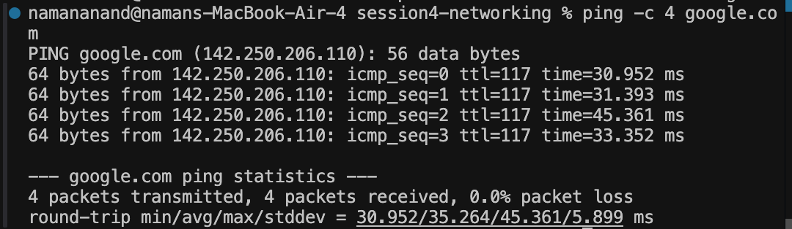
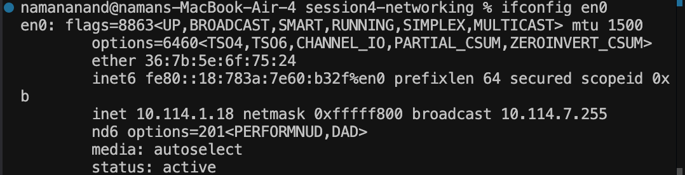
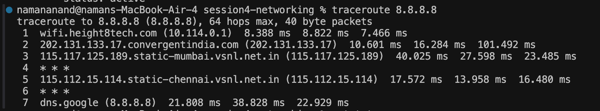
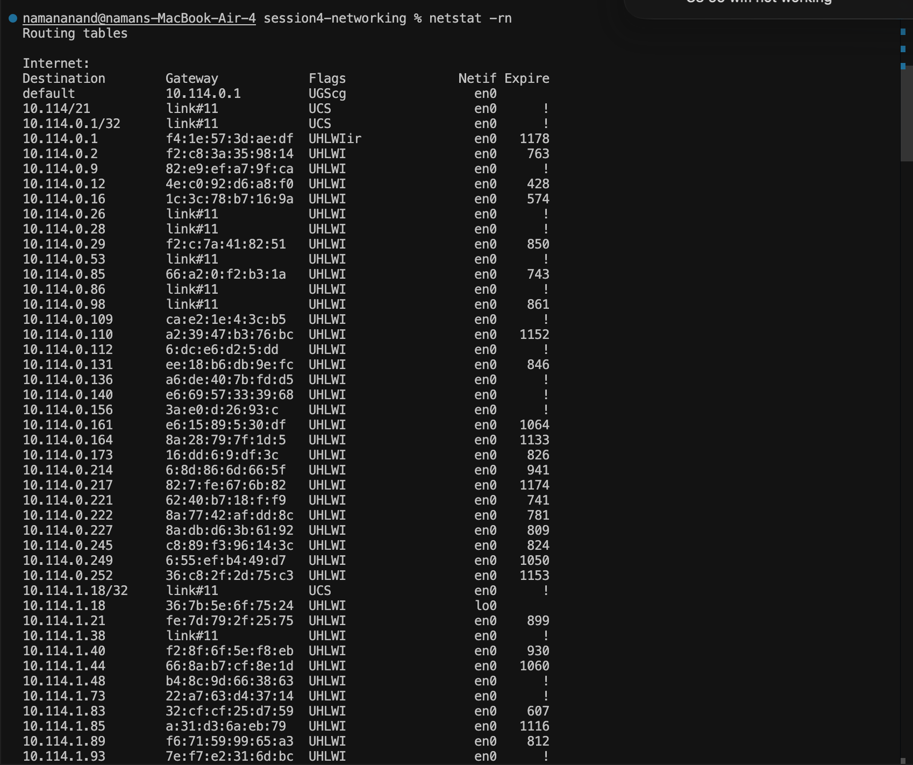
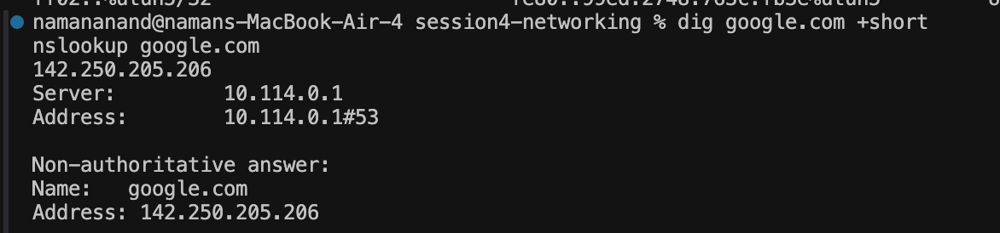
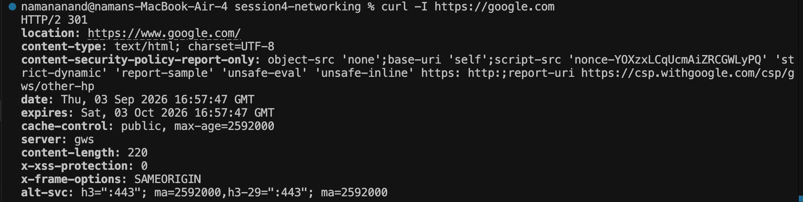

# Session 4: Networking Fundamentals

## Overview
This session covers core computer networking principles essential for DevOps engineers: IP Addressing (IPv4), Subnetting, CIDR notation, Private/Public IP address ranges, and network diagnostic utilities.

---

## Homework Tasks: Networking Commands & Concepts

### Task Description
1. Review IP addressing classes, network bits vs. host bits, subnet masks, and private IP ranges.
2. Execute core network diagnostic commands (`ping`, `ifconfig`, `traceroute`, `netstat`, `dig`, `nslookup`, `curl`).
3. Provide a short explanation of what each command does and what was learned.
4. Include screenshot evidence placeholders for homework submission.

---

## Commands Used
- `ping` : Tests network reachability between host and target IP using ICMP Echo packets.
- `ifconfig` / `ip` : Displays active network interface details, IP addresses, netmasks, and link state.
- `traceroute` : Traces the hop-by-hop router path packets take to reach a target destination.
- `netstat -rn` : Displays system routing tables, default gateways, and network interface mappings.
- `dig` : Performs flexible DNS lookups to query domain records (A, CNAME, MX) and DNS response times.
- `nslookup` : Queries DNS name servers to resolve hostnames to IP addresses.
- `curl -I` : Transfers data to/from servers and inspects HTTP response headers without fetching payload.

---

## IP Addressing & Subnetting Guide

### 1. IPv4 Classes & Structure
IPv4 addresses consist of 32 bits divided into 4 octets (8 bits each).

| Class | First Octet Range | Default Subnet Mask | Network Bits | Host Bits | Usable Hosts (`2^H - 2`) | Use Case |
| :--- | :--- | :--- | :--- | :--- | :--- | :--- |
| **Class A** | 1 – 127 | `255.0.0.0` (/8) | 8 | 24 | 16,777,214 | Very large enterprise networks |
| **Class B** | 128 – 191 | `255.255.0.0` (/16) | 16 | 16 | 65,534 | Medium to large networks |
| **Class C** | 192 – 223 | `255.255.255.0` (/24) | 24 | 8 | 254 | Small local networks |
| **Class D** | 224 – 239 | Reserved | N/A | N/A | N/A | Multicast communication |

### 2. Private IP Ranges (RFC 1918)
Private IP addresses are non-routable over the public Internet and used inside local networks (LANs / VPCs):
- **Class A**: `10.0.0.0` – `10.255.255.255` (`10.0.0.0/8`)
- **Class B**: `172.16.0.0` – `172.31.255.255` (`172.16.0.0/12`)
- **Class C**: `192.168.0.0` – `192.168.255.255` (`192.168.0.0/16`)

---

## Command Explanations & Commands Executed

### 1. `ping` (Packet Internet Groper)
Sends ICMP Echo Request messages to a target IP/domain and listens for ICMP Echo Reply packets. It measures Round-Trip Time (RTT) and detects packet loss to verify basic network connectivity.

```bash
ping -c 3 google.com
```

### 2. `ifconfig` / `ip` (Interface Configuration)
Displays active network interfaces, assigned IP addresses (IPv4 & IPv6), subnet masks, broadcast addresses, MAC addresses (`ether`), and network interface state (`UP`, `RUNNING`).

```bash
ifconfig en0
```

### 3. `traceroute` (Route Trace Utility)
Traces the hop-by-hop path packets take across network routers to reach a destination host by incrementally increasing packet Time-To-Live (TTL) values. Useful for pinpointing network latency bottlenecks or route failures.

```bash
traceroute -m 3 8.8.8.8
```

### 4. `netstat` (Network Statistics & Routing Tables)
Displays active network routing tables, default gateways, network interfaces (`Netif`), and destination subnets. Helps understand how packets are routed out of the local machine.

```bash
netstat -rn
```

### 5. `dig` (Domain Information Groper)
Performs flexible DNS lookups to resolve domain names to IP addresses (A records), MX records, or CNAMEs. The `+short` flag returns a concise IP address result.

```bash
dig google.com +short
```

### 6. `nslookup` (Name Server Lookup)
Queries DNS name servers to query domain records and confirm which local DNS resolver resolved the query.

```bash
nslookup google.com
```

### 7. `curl` (Client URL Utility)
Transfers data to or from a server using HTTP/HTTPS protocols. The `-I` flag fetches HTTP response headers (HTTP status code, redirection location, date, server type) without downloading the body.

```bash
curl -I https://google.com
```

---

## Task Screenshots & Evidence

### 1. `ping` Command Output Screenshot


### 2. `ifconfig` / `ip` Interface Output Screenshot


### 3. `traceroute` Command Output Screenshot


### 4. `netstat` Routing Table Screenshot


### 5. `dig` & `nslookup` DNS Lookup Screenshot


### 6. `curl` HTTP Header Inspection Screenshot


---

## Session Resources
- [IP Addressing & Subnetting Notes](./ip.md)
- [Networking Repositories & Guides](./resources.md)
