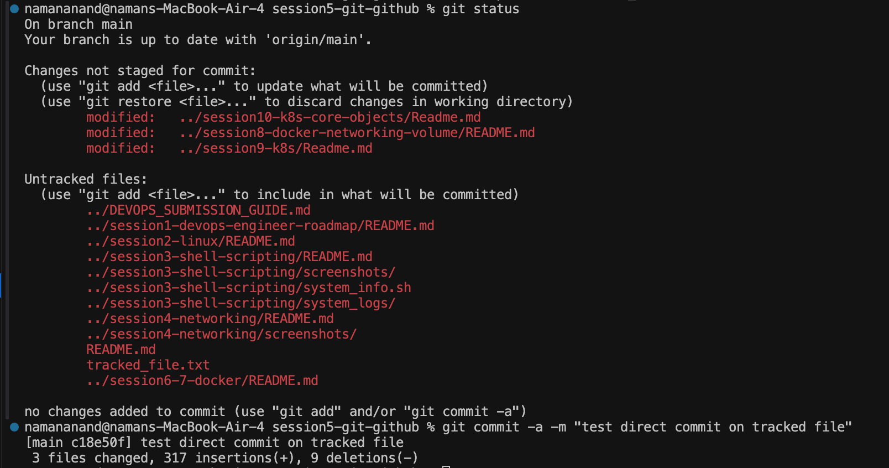
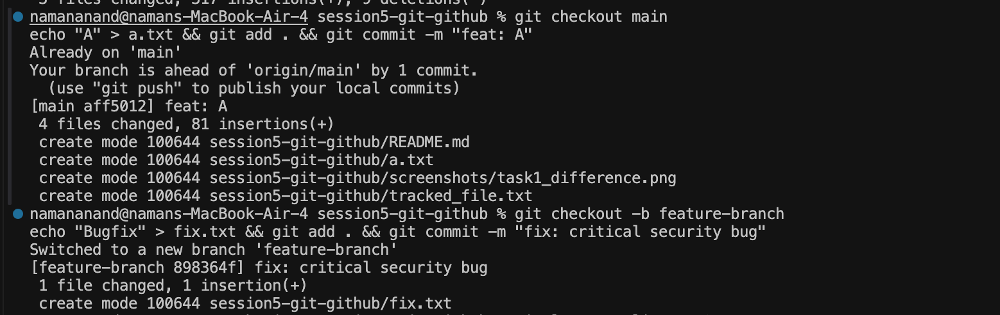
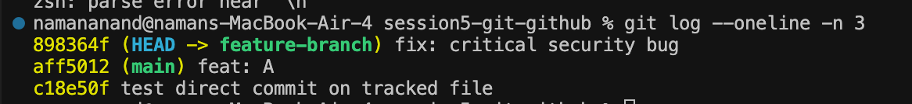

# Session 5: Git & GitHub Workflows

## Overview
This session covers intermediate Version Control operations using Git, including commit flags (`git commit -a -m`), branch management, and selective commit porting using `git cherry-pick`.

---

## Homework Tasks & Solutions

### Task 1: `git commit -a -m` vs. `git commit -m`

#### Comparison & Difference
- **`git commit -m "message"`**:
  Commits only files that are currently in the **staging area** (index), marked via `git add`. Unstaged modified files are ignored.
- **`git commit -a -m "message"`**:
  Automatically stages and commits **all tracked, modified files** in one step, bypassing the explicit `git add` step. New/untracked files will NOT be automatically committed.

#### Demonstration Commands
```bash
# Modify a tracked file
echo "Updated content" >> README.md

# Option A: Standard 2-step process
git add README.md
git commit -m "docs: update readme"

# Option B: Automated 1-step process for tracked modified files
git commit -a -m "docs: update readme directly"
```

#### Task Screenshot & Evidence


---

### Task 2: Git Cherry-Pick Workflow

#### Overview
Cherry-picking in Git allows you to pick an arbitrary commit from any branch by its SHA hash and apply it onto your current working branch.

#### Step-by-Step Execution Guide

```bash
# 1. Ensure you are on main branch and make commits
git checkout main
echo "Feature A" > featureA.txt && git add . && git commit -m "feat: Add Feature A"
echo "Feature B" > featureB.txt && git add . && git commit -m "feat: Add Feature B"

# 2. View main branch commit log
git log --oneline -n 3

# 3. Create and switch to new feature branch
git checkout -b feature-dev

# 4. Make commits on feature branch
echo "Bugfix X" > bugfix.txt && git add . && git commit -m "fix: Resolve critical security issue X"
echo "Draft Y" > draft.txt && git add . && git commit -m "feat: Experimental draft feature Y"

# 5. Note the commit SHA of the bugfix commit (e.g. a1b2c3d)
git log --oneline -n 2

# 6. Switch back to main branch
git checkout main

# 7. Cherry-pick only the bugfix commit from feature-dev branch into main
git cherry-pick a1b2c3d

# 8. Verify that the bugfix commit is now present in main
git log --oneline -n 3
```

#### Task Screenshots & Evidence



---

## Session Resources
- [Git Cheat Sheet & Resources](./resources.md)
