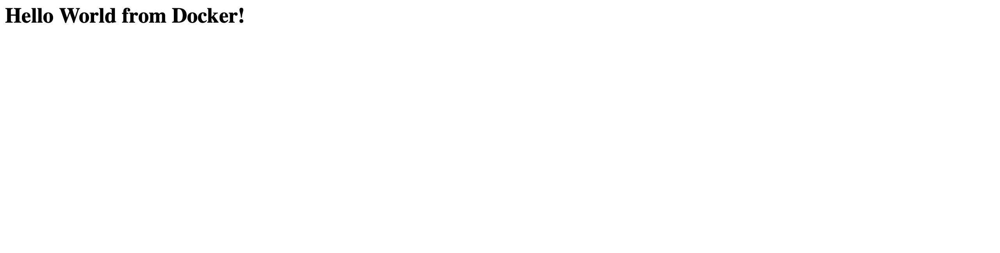
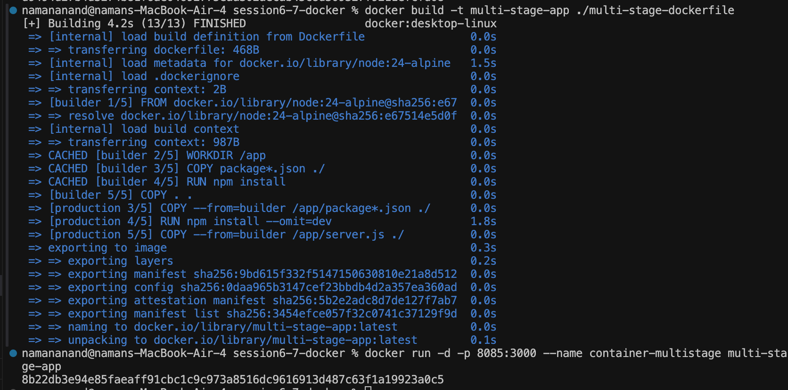
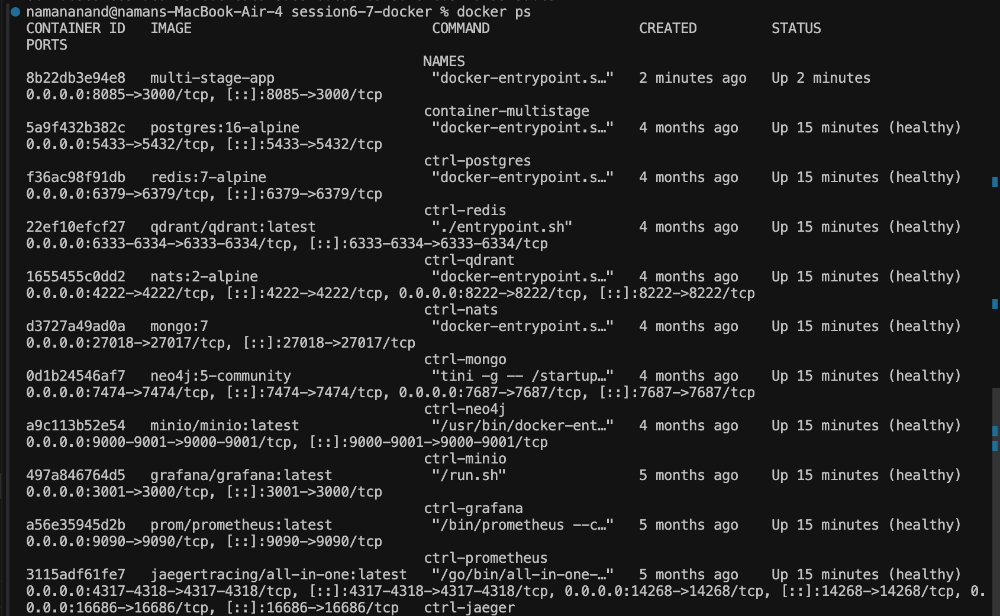

# Session 6 & 7: Docker Fundamentals & Multi-Stage Builds

## Overview
This session covers Docker containerization fundamentals, writing Dockerfiles for various application runtimes, building container images, container lifecycle management, and optimizing image size using Multi-Stage Builds.

---

## Homework Task 1: Hello World Applications

### Application Folders & Structure
- `node-app/`: Node.js web server.
- `python-app/`: Python Flask web application.
- `nginx-web/`: Nginx static web server.
- `multi-stage-dockerfile/`: Multi-stage built Node.js application.

---

### Dockerfiles & App Setup Across Stacks

#### 1. Node.js Application (`node-app/Dockerfile`)
```dockerfile
FROM node:18-alpine
WORKDIR /app
COPY package*.json ./
RUN npm install
COPY . .
EXPOSE 3000
CMD ["node", "index.js"]
```


#### 2. Python Application (`python-app/Dockerfile`)
```dockerfile
FROM python:3.9-slim
WORKDIR /app
COPY requirements.txt .
RUN pip install --no-cache-dir -r requirements.txt
COPY . .
EXPOSE 5000
CMD ["python", "app.py"]
```


#### 3. Apache Web Application
```dockerfile
FROM httpd:2.4-alpine
COPY ./public-html/ /usr/local/apache2/htdocs/
EXPOSE 80
```


#### 4. Nginx Web Application (`nginx-web/Dockerfile`)
```dockerfile
FROM nginx:alpine
COPY ./index.html /usr/share/nginx/html/index.html
EXPOSE 80
```


---

## Homework Task 2: Multi-Stage Dockerfile Build

### Overview
Multi-stage Docker builds allow using multiple `FROM` instructions in a single Dockerfile. Dependencies and build tools are used in build stages, and only final minimal artifacts are copied into the lean production image.

### Multi-Stage Dockerfile (`multi-stage-dockerfile/Dockerfile`)

```dockerfile
# -------------------------
# Stage 1: Build Phase
# -------------------------
FROM node:24-alpine AS builder
WORKDIR /app
COPY package*.json ./
RUN npm install
COPY . .

# -------------------------
# Stage 2: Production Phase
# -------------------------
FROM node:24-alpine AS production
WORKDIR /app
COPY --from=builder /app/package*.json ./
RUN npm install --omit=dev
COPY --from=builder /app/server.js ./
EXPOSE 3000
CMD ["npm", "start"]
```

### Build & Run Verification Commands
```bash
# 1. Build Multi-stage image
docker build -t multi-stage-app:latest ./multi-stage-dockerfile

# 2. Run Container on Port 8080 (mapping host 8080 -> container 3000)
docker run -d -p 8080:3000 --name container-8080 multi-stage-app:latest

# 3. Verify running container
docker ps
```

### Multi-Stage Task Screenshots & Evidence



---

## Docker Utility & Cleanup Commands

```bash
# Stop all running containers
docker stop $(docker ps -q)

# Remove all stopped containers
docker rm $(docker ps -aq)

# Force stop and remove all containers in one step
docker rm -f $(docker ps -aq)

# Remove all Docker images
docker rmi -f $(docker images -q)

# System-wide Docker cleanup (prune unused volumes, networks, images, containers)
docker system prune -a --volumes
```


---

## Session Resources
- [Docker Fundamentals Guide PDF](./docker-basic-cmd.pdf)
- [Advanced Docker Commands PDF](./docker-advance-cmd.pdf)
- [Docker Interview Questions PDF](./docker-interview-qa.pdf)
- [Docker Notes](./docker.md)
